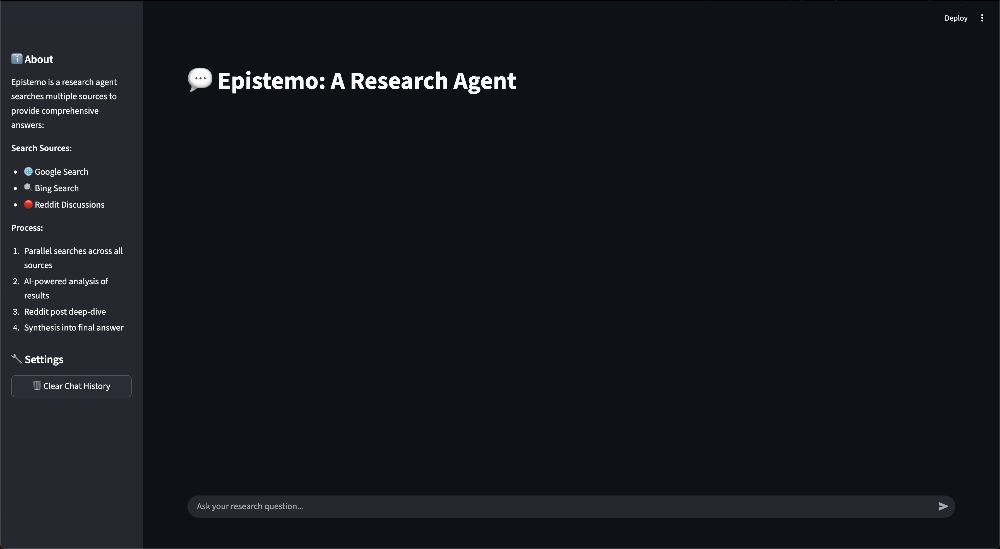
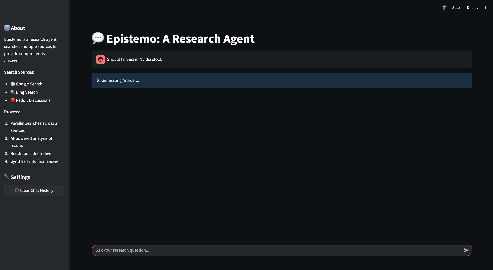
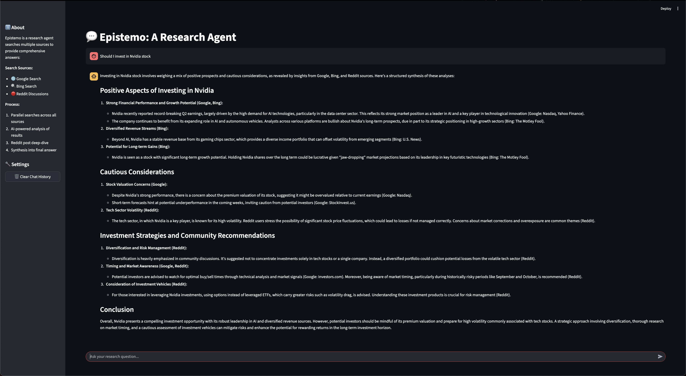

# 📚 Epistemo – Multi-Source Research Agent

Epistemo is an **AI-powered research chatbot** that searches **Google, Bing, and Reddit** in parallel to provide synthesized answers to queries.  
It is designed for product reviews, day-to-day questions, and exploratory research.  

This project combines **LangGraph**, **LangChain**, **FastAPI**, and **Streamlit** to deliver a clean, chat-style interface with real-time research capabilities.

---

## ✨ Features

- **🖥️ Modern Web Interface** – Responsive, user-friendly Streamlit UI  
- **💬 Chat-Style Interaction** – Seamless conversation flow with a chatbot-like experience  
- **🔍 Multi-Source Search** – Parallel research across Google, Bing, and Reddit  
- **🤖 AI-Powered Analysis** – Summarizes and synthesizes results using GPT-4o  
- **📊 Research Status Feedback** – Clear visual cues for "in progress" vs. "ready"  

---

## 🛠️ Architecture & Flow

1. **User Input**: A question is entered into the Streamlit chat UI.  
2. **Parallel Search**: LangGraph agents scrape results from Google, Bing, and Reddit.  
3. **Reddit Deep Dive**:  
   - LLM filters relevant Reddit posts.  
   - Pydantic schema ensures valid structured responses.  
   - Scraper collects post comments.  
4. **Source Summaries**: LLM summarizes Bing, Google, and Reddit results individually.  
5. **Final Synthesis**: Summaries are combined via GPT-4o to produce a final answer.  
6. **Presentation**: Results are returned via FastAPI (`/research`) and displayed in Streamlit.  

---

## 🛠️ Tech Stack

- **Frontend**: [Streamlit](https://streamlit.io/) for a modern, interactive chat-style UI  
- **Backend**: [FastAPI](https://fastapi.tiangolo.com/) to expose the `/research` API endpoint  
- **Agents & Orchestration**: [LangGraph](https://www.langchain.com/langgraph) and [LangChain](https://www.langchain.com/) for multi-agent workflows  
- **LLM**: [OpenAI GPT-4o](https://platform.openai.com/) for analysis, summarization, and synthesis  
- **Web Scraping**: Integrated Google, Bing, and Reddit data collection pipelines  
- **Data Validation**: [Pydantic](https://docs.pydantic.dev/) for structured responses and validation  
- **Environment & Packaging**: [uv](https://github.com/astral-sh/uv) for fast dependency management  
- **Server**: [Uvicorn](https://www.uvicorn.org/) as the ASGI server for FastAPI  

---

### 🎬 Demo Video

You can watch the demo video [here](https://youtu.be/59c6FIyZkNY).

---

### 📸 Screenshots    

| Sample UI – Chat Interface | Conducting Research | Generated Answer in Conversation View |
|-----------|----------------|---------------|
|  |  |  |

---

## ⚙️ Setup

This project uses [uv](https://github.com/astral-sh/uv) for dependency management.  

### 1. Clone the repository
```bash
git clone https://github.com/your-username/epistemo.git
cd epistemo
```

### 2. Install dependencies
```bash
uv sync
```

### 3. Start FastAPI backend

```bash
uvicorn api.research:app --reload
```
This will start the backend at  `http://localhost:8000` with the  `/research` endpoint.

### 4. Run the Streamlit frontend

```bash
streamlit run app.py
```

---

## 💡 Usage Tips

1. **Ask Clear Questions** – More specific queries yield better synthesized results.
2. **Clear History** – Use the sidebar button to reset chat and logs.

---

## 🔮 Future Improvements
- 🌍 Add more data sources (YouTube, Twitter, ArXiv)
- ⚡ Streaming responses for real-time partial answers
- 🔐 Authentication & user-specific histories
- 📊 Dashboard for multi-query comparisons

---

## 📂 Project Structure

```bash
epistemo/
│── app.py                # Streamlit frontend (chat UI)
│── api/
│   └── research.py       # FastAPI backend with /research endpoint
│── cli/                  # Command-line interface implementation
│── config/               # Configuration management (settings, environment)
│── core/                 # Graph builder, agents, and state management
│── models/               # Pydantic models and data schemas
│── services/             # External service integrations (scrapers, APIs, etc.)
│── ui/                   # UI-related helpers/components
│── utils/                # Logging, utilities, and common helpers
│── pyproject.toml        # Dependencies & project config
```

---


